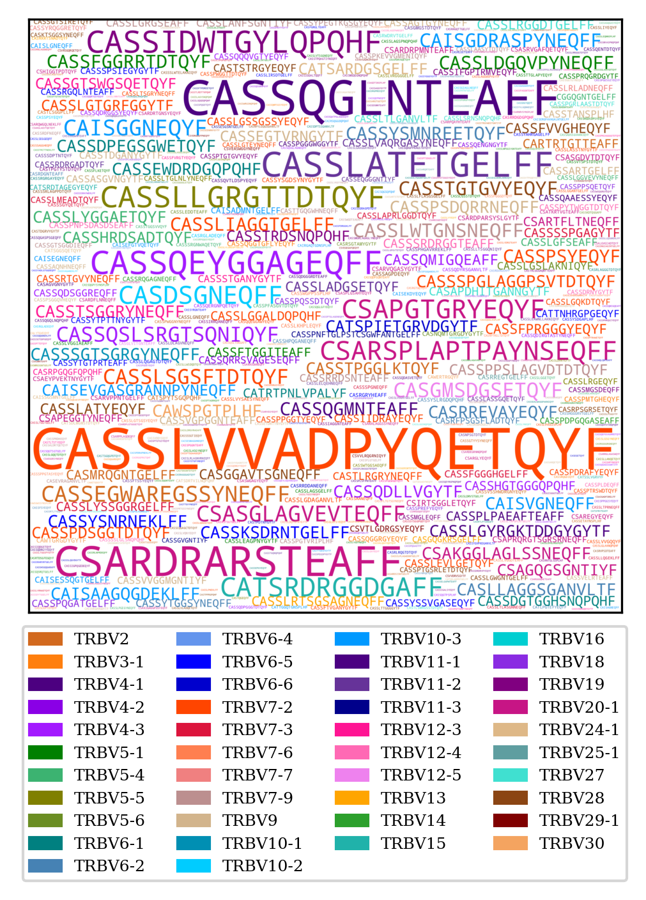
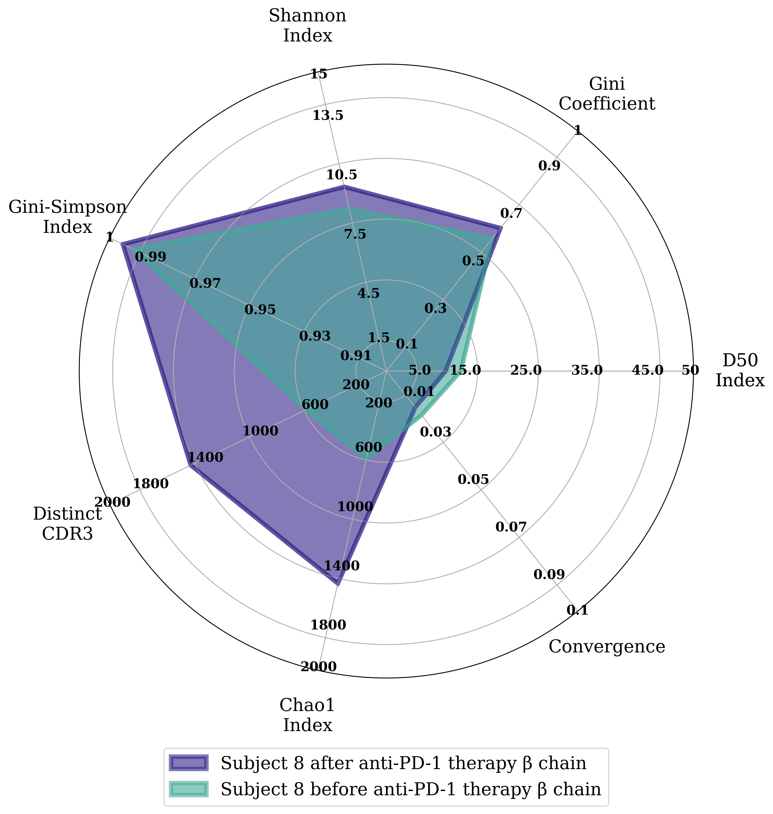

# TCRcloud

TCRcloud is a TCR repertoire visualization and comparison tool

Works with all four chains of the TCR

## TRA

## TRB

## TRG
 

## TRD
 

## Diversity comparison

**Still in development**